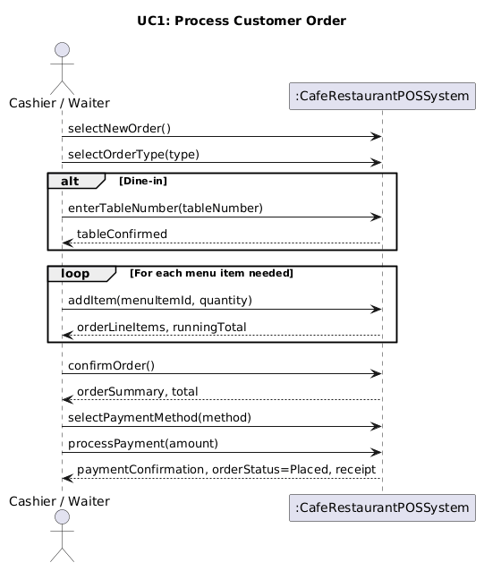
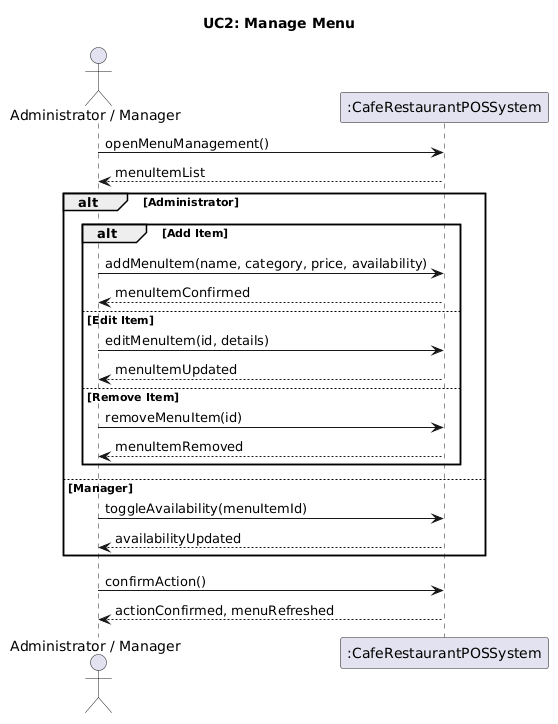
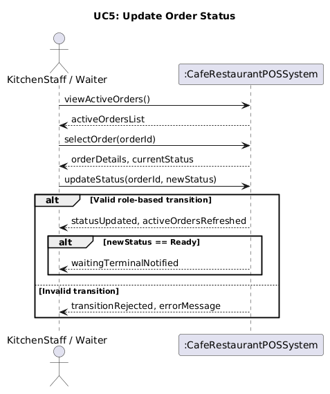

# System Sequence Diagrams
Cafe Restaurant POS System — Elaboration Phase, Iteration 1

This document presents the System Sequence Diagrams (SSDs) for the three
highest-priority use cases identified for Iteration 1. Each SSD shows the
interactions between an external actor and the system treated as a black box,
using the operation names derived from the fully-dressed use cases.

SSDs covered:
- UC1: Process Customer Order
- UC2: Manage Menu
- UC5: Update Order Status

---

## SSD 1 — UC1: Process Customer Order

**Actor:** Cashier / Waiter  
**Diagram:** 

**Key messages:**
- `selectNewOrder()` — Actor initiates a new order transaction
- `selectOrderType(type)` — Actor selects Counter or Dine-in
- `enterTableNumber(tableNumber)` — Dine-in only; system validates the table exists
- `addItem(menuItemId, quantity)` — Repeated for each item; system returns updated OrderLineItem list and running total
- `confirmOrder()` — System returns full Order summary and total
- `selectPaymentMethod(method)` — Actor selects Cash, Card, or MobileMoney
- `processPayment(amount)` — System processes Payment, sets Order status to Placed, refreshes kitchen display queue, and prints receipt

---

## SSD 2 — UC2: Manage Menu

**Actor:** Administrator / Manager  
**Diagram:** 

**Key messages:**
- `openMenuManagement()` — System returns current MenuItem list
- Administrator path: `addMenuItem()`, `editMenuItem()`, or `removeMenuItem()` — full CRUD operations on MenuItems
- Manager path: `toggleAvailability(menuItemId)` — restricted to availability updates only, enforced by RBAC
- `confirmAction()` — System confirms the change and refreshes the menu display across all terminals

---

## SSD 3 — UC5: Update Order Status

**Actor:** KitchenStaff / Waiter  
**Diagram:** 

**Key messages:**
- `viewActiveOrders()` — System returns all active Orders with current statuses
- `selectOrder(orderId)` — System returns Order details and current status
- `updateStatus(orderId, newStatus)` — Actor transitions the Order to the next valid state
- Valid transition: system confirms update and refreshes Active Orders display
- If newStatus == Ready: system refreshes Waiter terminal display to make Ready order visually prominent
- Invalid transition: system rejects the update and returns an error message enforcing the Placed → Preparing → Ready → Served lifecycle

