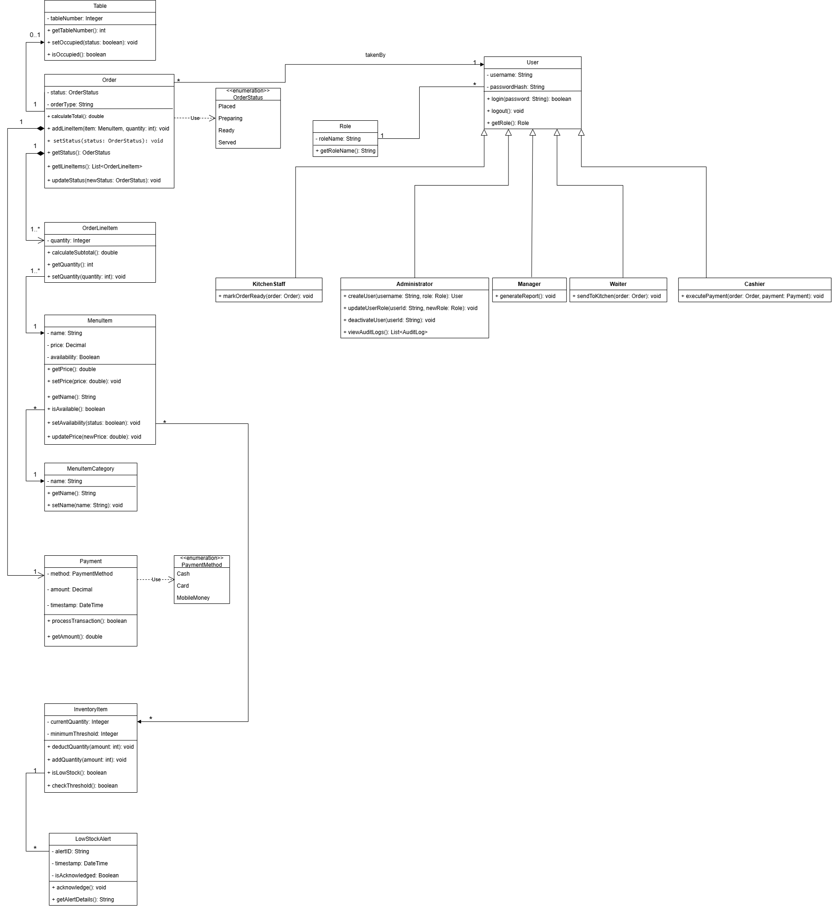

# 02. Design Class Diagram Specification

## 1. Document Overview & Project Phase Context

### 1.1 Document Purpose
This document provides the formal architectural specification for the Design Class Diagram (DCD) of the Cafe Point of Sale (POS) System. While the conceptual Domain Model focused on real-world business entities and static domain relationships, this Design Class Diagram specifies concrete software implementation details. It acts as the bridge between conceptual analysis and object-oriented code implementation.

### 1.2 Iteration & Phase Context
* **Project Phase:** Software Design & Architectural Specification (Iteration 2)
* **System Focus:** Cafe Point of Sale (POS) & Inventory System
* **Predecessor Artifact:** `02_Domain_Model.md` / `domain_model.png` (Conceptual Domain Analysis)
* **Successor Artifact:** Object-oriented implementation code, database schemas, and unit test suites.

In this iteration, the static domain model is refined into an executable software design by introducing visibility modifiers, concrete programming data types, full method signatures with parameters, explicit collection types, navigable associations, and enumerations.

---

## 2. Transition Breakdown: Conceptual Domain Model to Design Class Diagram

To transition from the conceptual domain model to the design class diagram, structural and behavioral refinements were applied across all system clusters:

1. **Encapsulation & Visibility Modifiers:**
   * All attributes have been strictly encapsulated using private visibility (`-`).
   * All public interactions and behaviors are exposed via public methods (`+`).

2. **Refinement of Primitive Data Types:**
   * Conceptual attributes were converted to explicit programming language types (e.g., `String`, `int`, `double`, `boolean`, `DateTime`).
  

3. **Method Signatures & Behavior Distribution:**
   * Methods, return types, and input parameters were assigned directly to the entity classes that own the required data, adhering to the Information Expert design principle.
   * State transitions, financial calculations, and stock operations were formalized into concrete method signatures (e.g., `calculateTotal(): double`, `isOccupied(): boolean`).

4. **Directed Navigability & Dependency Notation:**
   * Association lines were updated with directed open arrowheads (`>`) to represent object reference paths in code.
   * Enumerations were explicitized using the `<<enumeration>>` stereotype, with dashed dependency arrows (`- - ->`) pointing from referencing entities to their enum definitions.

---

## 3. Key Design Decisions & Method Rationale

The table below outlines the key behavioral methods added during this design iteration, identifying their target classes and the architectural rationale for their placement:

| Target Class | Added Method Signature | Rationale & Architectural Design Decision |
| :--- | :--- | :--- |
| **Order** | `+ setStatus(status: OrderStatus): void` | Encapsulates order state transitions. Corrected to accept an `OrderStatus` enum parameter rather than an entity reference. |
| **Order** | `+ calculateTotal(): double` | Adheres to Information Expert by having `Order` calculate its overall monetary sum using its internal `lineItems` collection. |
| **Order** | `+ addLineItem(item: OrderLineItem): void` | Maintains composition integrity by managing the lifecycle and list addition of `OrderLineItem` instances inside `Order`. |
| **OrderLineItem** | `+ calculateSubtotal(): double` | Computes the extended cost (`quantity * itemPrice`) at the line-item level, insulating `Order` from individual item math. |
| **Table** | `+ isOccupied(): boolean` | **Getter Fix:** Provides essential boolean state inspection alongside `setOccupied(status: boolean): void` for table availability checking. |
| **Table** | `+ setOccupied(status: boolean): void` | Setter method allowing table status updates when dining orders are placed or cleared. |
| **MenuItem** | `+ isAvailable(): boolean` | Allows ordering components to check whether a menu item can currently be prepared or selected. |
| **MenuItem** | `+ setPrice(price: double): void` | Encapsulates administrative price updates on menu offerings without directly exposing raw fields. |
| **InventoryItem** | `+ deductQuantity(amount: int): void` | Executes controlled stock deductions during order processing while keeping stock data encapsulated. |
| **InventoryItem** | `+ isLowStock(): boolean` | Compares `currentQuantity` against `minimumThreshold` to determine if a low-stock alert trigger condition exists. |
| **LowStockAlert** | `+ acknowledge(): void` | Allows management or kitchen staff to update and clear persistent stock alerts once stock is replenished. |
| **User** | `+ login(password: String): boolean` | Base authentication method for all user subtypes (`Cashier`, `Waiter`, `Manager`, `Admin`, `KitchenStaff`). |
| **Waiter** | `+ sendToKitchen(order: Order): void` | Specialized role behavior allowing a waiter to transition a created order to kitchen queue processing. |
| **Cashier** | `+ executePayment(order: Order, payment: Payment): void` | Role-specific operation isolating financial settlement responsibility to cashier accounts. |
| **KitchenStaff** | `+ markOrderReady(order: Order): void` | Role-specific workflow operation updating order status when preparation completes. |
| **Administrator** | `+ createUser(username: String, role: Role): User` | Allows administrators to provision new staff user accounts and assign initial roles within the system. |
| **Administrator** | `+ updateUserRole(userId: String, newRole: Role): void` | Encapsulates privilege management, permitting administrators to modify staff access levels as roles change. |

---

## 4. Visual Diagram Reference

The architectural structure specified in this document is rendered in the Design Class Diagram artifact:

*Figure 1.0 — Design Class Diagram (DCD) for the Cafe Point of Sale (POS) System.*

---

## 5. Summary of Design Phase Deliverables

This phase marks the transition from conceptual domain modeling to a concrete, implementation-ready software architecture:

1. **Design Class Diagram Specification:**
   Establishes the structural and behavioral software architecture for the Cafe POS system by incorporating concrete programming data types, encapsulated access control (`-`/`+`), full method signatures, explicit collection multiplicities, and navigable associations.
2. **Behavioral Distribution & Encapsulation:**
   Distributes domain math, state transitions, and role-based permissions directly to the relevant entity classes and specialized user subtypes based on the Information Expert principle, bypassing unnecessary controller complexity while preserving object-oriented design principles.
3. **Traceability & Implementation Readiness:**
   Serves as the binding blueprint for downstream object-oriented coding, database entity mappings, and unit test implementations for subsequent development iterations.