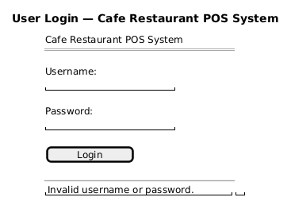
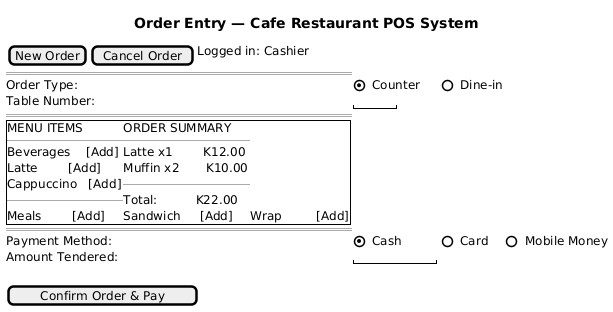
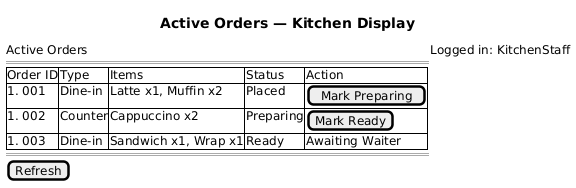
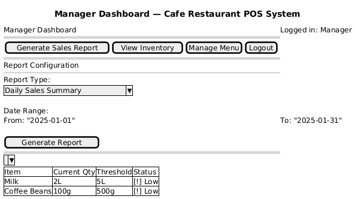

# UI Prototypes
Cafe Restaurant POS System — Elaboration Phase, Iteration 2

This document presents wireframe prototypes for the four primary screens
of the Cafe Restaurant POS system. These are low-fidelity mockups produced
during Elaboration to validate the user interface structure against the
fully-dressed use cases. They are not final designs — layout and styling
will be refined during Construction.

---

## Screen 1: User Login

The login screen is the system entry point for all users. It collects
username and password credentials and displays an inline error message
for invalid attempts. Serves UC6 (User Login).

---

## Screen 2: Order Entry

The order entry screen allows a Cashier or Waiter to create a new order.
The Actor selects order type (Counter or Dine-in), browses menu items by
category, builds the order summary with running total, selects a payment
method, and confirms payment in a single screen flow. Serves UC1 (Process
Customer Order).

---

## Screen 3: Kitchen Active Orders Display

The kitchen display shows all active orders with their Order ID, type,
items, and current status. Kitchen Staff can mark an order as Preparing
or Ready directly from this screen. Orders at Ready status show "Awaiting
Waiter" to signal the handoff. A Refresh button updates the display
manually. Serves UC5 (Update Order Status).

---

## Screen 4: Manager Dashboard

The manager dashboard provides access to sales reporting, inventory
overview, and menu management from a single screen. The report
configuration panel allows the Manager to select report type and date
range before generating. The inventory panel displays current stock
levels with low-stock status indicators. Serves UC3 (Generate Sales
Report) and UC4 (Update Inventory).