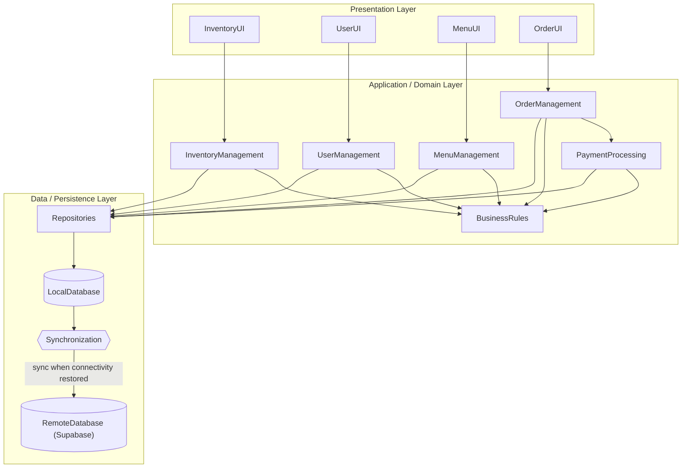
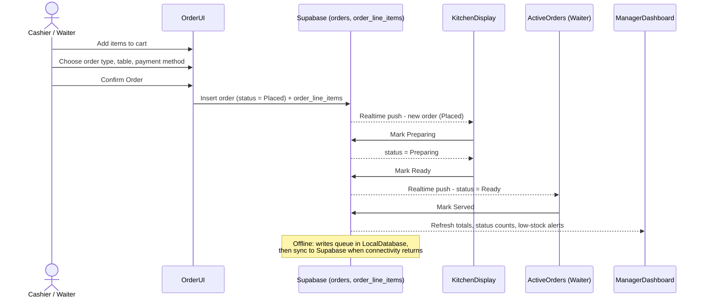

# Cafe Restaurant POS System — Architecture & System Workflow

**Project:** Cafe Restaurant POS System
**Course:** CSC4630 Advanced Software Engineering
**Phase:** Construction (Iterations 3–4), consolidating the approved Elaboration architecture
**Stack:** React (Vite) + Supabase (Postgres, Auth, Realtime)

This document consolidates the architecture that was designed and approved during
Elaboration (`04_Architectural_Proof_of_Concept.md`) with the actual working system
built during Construction, and adds a clear picture of how data flows through the
system end-to-end. It is meant to sit in `docs/` alongside `defect_tracking.md` and the
Supabase schema.

---

## 1. Layered Architecture

The system follows a four-layer architecture. Dependencies flow downward only —
a layer only calls the layer directly below it, never upward and never skipping a layer.



### Layer responsibilities

| Layer | Responsibility | Built as |
|---|---|---|
| **Presentation** | Screens and forms staff actually touch — Login, Order Entry, Kitchen Display, Active Orders, Manager Dashboard | React components (`OrderUI`, `MenuUI`, `UserUI`, `InventoryUI`) |
| **Application / Domain** | Use-case logic and business rules — role-based routing, cart/total calculation, valid status transitions, low-stock detection | Plain JS functions and component logic (`calculateTotal`, `isValidTransition`, `isLowStock`) |
| **Data / Persistence** | Reads/writes and the offline-first mechanism | Supabase client calls (`Repositories`), with `LocalDatabase` / `Synchronization` / `RemoteDatabase` as the offline-first design target |

### Offline-first mechanism

This is the specific mechanism the Elaboration architecture review required — not just
"the system will work offline," but *how*:

- `LocalDatabase` is the primary store while the device has no network connectivity.
  Orders, status updates, and payments are written there first.
- `Synchronization` watches connectivity. When the network is detected as restored,
  it automatically pushes queued local transactions to `RemoteDatabase`.
- `RemoteDatabase` is Supabase (Postgres + Realtime). Once a write lands there,
  Realtime pushes it to every other connected screen (e.g. a new order appearing on
  the Kitchen Display).
- **Current build status:** the Construction build talks to Supabase directly for the
  demo (`REPO --> RDB` in practice), which is the correct simplification for a
  university demo on one network. The `LocalDatabase → Synchronization` queue is the
  designed mechanism for true offline operation and is the natural next increment for
  Transition, not a contradiction of the approved diagram — it's the same shape, with
  the local-queue-and-replay part not yet needed for a same-network classroom demo.

---

## 2. System Workflow — Order Lifecycle

This is the concrete, end-to-end flow of a single order through every role and screen,
matching the actual `orders.status` state machine enforced in the app and tested in
`tests/unit/statusTransition.test.js`.



### Status state machine

Only these transitions are valid — enforced in code and covered by
`statusTransition.test.js`:

```
Placed → Preparing → Ready → Served
```

No status may be skipped (e.g. `Placed → Served` directly is rejected), and `Served`
is terminal.

### Role → screen map

| Role | Screen(s) | What they do in the flow |
|---|---|---|
| Cashier | Order Entry (Counter) | Takes counter orders, confirms payment |
| Waiter | Order Entry (Dine-in) + Active Orders | Takes table orders; marks `Ready` orders as `Served` |
| KitchenStaff | Kitchen Display | Sees `Placed` orders, marks `Preparing` → `Ready` |
| Manager | Manager Dashboard | Views totals, revenue, status breakdown, low-stock alerts |
| Administrator | (role exists in schema; screen not yet built) | Reserved for future user/menu management |

### Data model backing this flow

`orders.status` drives the whole diagram above; `order_line_items` holds the cart
contents; `inventory_items` + `low_stock_alerts` back the Manager Dashboard's low-stock
panel. Full schema lives in `CONSTRUCTION/schema.sql` (10 tables, Supabase Realtime
enabled on `orders`).

---

## 3. Known simplifications (not defects)

Documented here so they read as intentional engineering trade-offs in review, not as
gaps:

- **RLS disabled on all tables** (see D002 in `defect_tracking.md`) — acceptable for a
  demo/classroom build, called out explicitly as not production-safe.
- **Sync path not yet exercised offline** — the architecture supports it
  (`LocalDatabase → Synchronization → RemoteDatabase`), but the Construction demo runs
  online throughout, so the queue-and-replay path hasn't been demonstrated live.
